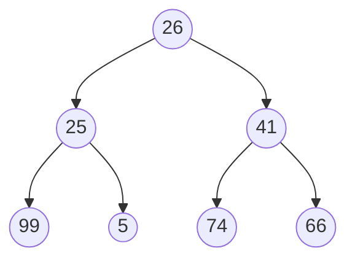

## 构建二叉树

```java
class TreeNode {
	// 节点的值
    int val;
    // 左子树
    TreeNode left;
    // 右子树
    TreeNode right;

    public TreeNode(int val) {
        this.val = val;
    }
}
```

手动创建二叉树需要逐个节点地创建，并为每个节点设置左子节点和右子节点的引用。这种方法适用于树的结构较小或特定形状的情况。例如，创建以下二叉树：

```java
// 根结点
TreeNode root = new TreeNode(26);
// 根节点的子节点
root.left = new TreeNode(25);
root.right = new TreeNode(41);
// 继续构建子节点
root.left.left = new TreeNode(99);
root.left.right = new TreeNode(5);
root.right.left = new TreeNode(74);
root.right.right = new TreeNode(66);
```

构建后的二叉树



## 二叉树的遍历方法


[**前序遍历**](#qxbl)（Preorder Traversal）：先访问根节点，然后按照左子树、右子树的顺序递归遍历子树。

遍历结果：26 --> 25 --> 99 --> 5 --> 41 --> 74 --> 66 

[**中序遍历**](#zxbl)（Inorder Traversal）：先按照左子树、根节点、右子树的顺序递归遍历子树。

遍历结果：99 --> 25 --> 5 --> 26 --> 74 --> 41 --> 66 

[**后序遍历**](#hxbl)（Postorder Traversal）：先按照左子树、右子树的顺序递归遍历子树，最后访问根节点。

遍历结果：99 --> 5 --> 25 --> 74 --> 66 --> 41 --> 26 

[**层序遍历**](#cxbl)（Level Order Traversal）：从上到下逐层遍历二叉树的节点。

遍历结果：26 --> 25 --> 41 --> 99 --> 5 --> 74 --> 66 

#### 示例代码

##### 前序遍历 <span id="qxbl">

```java
   /**
     * 前序遍历
     * 根、左、右
     */
    public static void preOrder(TreeNode treeNode) {
        if (null == treeNode) {
            return;
        }
        int val = treeNode.val;
        System.out.print(val + " ");
        preOrder(treeNode.left);
        preOrder(treeNode.right);
    }
```

##### 中序遍历 <span id="zxbl">

```java
    /**
     * 中序遍历
     * 左、根、右
     */
    public static void midOrder(TreeNode treeNode) {
        if (null == treeNode) {
            return;
        }
        midOrder(treeNode.left);
        System.out.print(treeNode.val + " ");
        midOrder(treeNode.right);
    }
```

##### 后序遍历 <span id="hxbl">

```java
     /**
     * 后序遍历
     * 左、右、根
     */
    public static void postOrder(TreeNode treeNode) {
        if (null == treeNode) {
            return;
        }
        postOrder(treeNode.left);
        postOrder(treeNode.right);
        System.out.print(treeNode.val + " ");
    }
```

##### 层序遍历 <span id="cxbl">

```java
    /**
     * 层序遍历--使用队列进行遍历
     * 从上到下逐层遍历二叉树的节点
     */
    public static void levelOrder(TreeNode treeNode) {
        Queue<TreeNode> queue = new LinkedList<>();
        // 将根节点入队
        queue.offer(treeNode);
        List<Integer> res = new ArrayList<>();
        // 循环入队、出队
        while (!queue.isEmpty()) {
            // 取出队首元素，存入结果数组
            TreeNode poll = queue.poll();
            res.add(poll.val);
            // 如果存在左节点，则入队
            if (null != poll.left) {
                queue.offer(poll.left);
            }
            // 如果存在右节点，则入队
            if (null != poll.right) {
                queue.offer(poll.right);
            }
        }
        // 打印结果
        for (Integer re : res) {
            System.out.print(re + " ");
        }
    }
```


