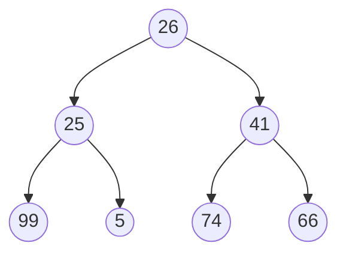
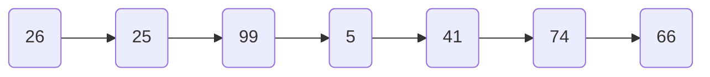
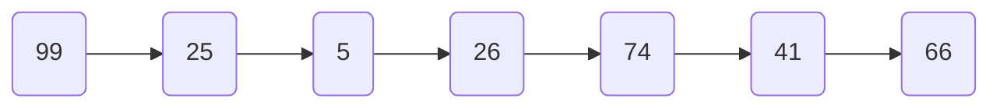
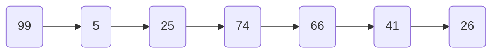
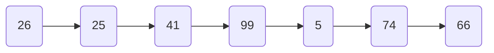
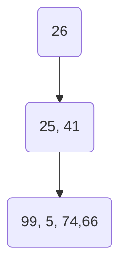

## 构建二叉树

```java
class TreeNode {
	// 节点的值
    int val;
    // 左子树
    TreeNode left;
    // 右子树
    TreeNode right;

    public TreeNode(int val) {
        this.val = val;
    }
}
```

手动创建二叉树需要逐个节点地创建，并为每个节点设置左子节点和右子节点的引用。这种方法适用于树的结构较小或特定形状的情况。例如，创建以下二叉树：

```java
// 根结点
TreeNode root = new TreeNode(26);
// 根节点的子节点
root.left = new TreeNode(25);
root.right = new TreeNode(41);
// 继续构建子节点
root.left.left = new TreeNode(99);
root.left.right = new TreeNode(5);
root.right.left = new TreeNode(74);
root.right.right = new TreeNode(66);
```

构建后的二叉树



## 二叉树的遍历方法

[**前序遍历**](#qxbl)（Preorder Traversal）：先访问根节点，然后按照左子树、右子树的顺序递归遍历子树。




[**中序遍历**](#zxbl)（Inorder Traversal）：先按照左子树、根节点、右子树的顺序递归遍历子树。



[**后序遍历**](#hxbl)（Postorder Traversal）：先按照左子树、右子树的顺序递归遍历子树，最后访问根节点。



[**层序遍历**](#cxbl)（Level Order Traversal）：从上到下逐层遍历二叉树的节点。






### 示例代码

### 前序遍历 <span id="qxbl">

```java
   /**
     * 前序遍历
     * 根、左、右
     */
    public static void preOrder(TreeNode treeNode) {
        if (null == treeNode) {
            return;
        }
        int val = treeNode.val;
        System.out.print(val + " ");
        preOrder(treeNode.left);
        preOrder(treeNode.right);
    }
```

### 中序遍历 <span id="zxbl">

```java
    /**
     * 中序遍历
     * 左、根、右
     */
    public static void midOrder(TreeNode treeNode) {
        if (null == treeNode) {
            return;
        }
        midOrder(treeNode.left);
        System.out.print(treeNode.val + " ");
        midOrder(treeNode.right);
    }
```

### 后序遍历 <span id="hxbl">

```java
     /**
     * 后序遍历
     * 左、右、根
     */
    public static void postOrder(TreeNode treeNode) {
        if (null == treeNode) {
            return;
        }
        postOrder(treeNode.left);
        postOrder(treeNode.right);
        System.out.print(treeNode.val + " ");
    }
```

### 层序遍历 <span id="cxbl">

遍历方法一：返回所有的节点值

```java
    /**
     * 层序遍历--使用队列进行遍历
     * 从上到下逐层遍历二叉树的节点
     */
    public static void levelOrder(TreeNode treeNode) {
        Queue<TreeNode> queue = new LinkedList<>();
        // 将根节点入队
        queue.offer(treeNode);
        List<Integer> res = new ArrayList<>();
        // 循环入队、出队
        while (!queue.isEmpty()) {
            // 取出队首元素，存入结果数组
            TreeNode poll = queue.poll();
            res.add(poll.val);
            // 如果存在左节点，则入队
            if (null != poll.left) {
                queue.offer(poll.left);
            }
            // 如果存在右节点，则入队
            if (null != poll.right) {
                queue.offer(poll.right);
            }
        }
        // 打印结果
        for (Integer re : res) {
            System.out.print(re + " ");
        }
    }
```

遍历方法二：逐层返回节点值

```java
	/**
     * 层序遍历
     * 步骤1：对二叉树每一层的节点进行入队，然后出队，取出出队的节点值
     * 步骤2：判断左右子树是否为null，左子树入队，右子树入队
     *
     * @param root 二叉树
     * @return
     */
    public List<List<Integer>> preorderTraversal(TreeNode root) {
        List<List<Integer>> resList = new ArrayList<>();
        if (root == null) {
            return resList;
        }
        Queue<TreeNode> queue = new LinkedList<>();
        // 根节点入队
        queue.add(root);
        while (!queue.isEmpty()) {
            List<Integer> list = new ArrayList<>();
            // 循环取每层的元素
            int size = queue.size();
            // 使用size，避免队列长度发送变化
            for (int i = 0; i < size; i++) {
                TreeNode poll = queue.poll();
                list.add(poll.val);
                // 左子树入队
                if (poll.left != null) {
                    queue.add(poll.left);
                }
                // 右子树入队
                if (poll.right != null) {
                    queue.add(poll.right);
                }
            }
            resList.add(list);
        }
        System.out.println(resList);
        return resList;
    }
```


## 递归解决树的问题

通常，可以通过 “自顶向下” 或 “自底向上” 的递归来解决树问题。

### “自顶向下” 的解决方案

“自顶向下” :首先访问跟节点，再访问左节点，最后访问右节点，然后递归进行再次访问左右节点。

 “自顶向下” 的解决方案可以被认为是一种**前序遍历**。

示例：给定一个二叉树，请寻找它的最大深度

```Java
	/**
     * 定义全局深度值
     */
    int answer = 0;

    public int maxDepth(TreeNode root) {
        if (root == null) {
            return 0;
        }
        // 初始化分支深度值
        int depth = 0;
        maxLength(root, depth);
        System.out.println(answer);
        return answer;
    }
    
    
    /**
     * 递归获取最大深度
     *
     * @param root  二叉树
     * @param depth 树的深度
     */
    private void maxLength(TreeNode root, int depth) {
    	// 如果lef==null或right==null,则代表以及递归完成
        if (root.left == null || root.right == null) {
        	// 此时判断当前分支深度与answer的大小，得到较大的一个
            answer = Math.max(answer, depth);
        }
        // 不为null时，继续递归
        if (root.left != null) {
            maxLength(root.left, depth + 1);
        }
        if (root.right != null) {
            maxLength(root.right, depth + 1);
        }
    }
```


### “自底向上” 的解决方案

在每个递归层次上，我们首先对所有子节点递归地调用函数，然后根据返回值和根节点本身的值得到答案。 这个过程可以看作是**后序遍历**的一种。

示例：给定一个二叉树，请寻找它的最大深度

```java
	
	/**
     * 查找二叉树的深度
     */
    public int maxDepth(TreeNode root) {
        if (root == null) {
            return 0;
        }
        System.out.println(bottomUpDepth(root));
        return bottomUpDepth(root);
    }
	
	
	/**
     * 自底而上进行深度查找
     *
     * @param root 二叉树
     * @return 树的深度
     */
    public int bottomUpDepth(TreeNode root) {
        // null时，为末尾节点，返回0
        if (root == null) {
            return 0;
        }
        // 递归到末尾节点
        int leftDepth = bottomUpDepth(root.left);
        int rightDepth = bottomUpDepth(root.right);
        // 每次递归return时，深度+1，即向上查找一次
        return Math.max(leftDepth, rightDepth) + 1;
    }
```

### 总结

何时使用“自顶向下”递归：

> 能确定一些参数，从该节点自身出发寻找结果值
>
> 可以使用这些参数和节点本身的值，来决定如何给子节点传递参数

何时使用“自底向上”递归：

> 对于树中的任意一个节点，知道它子节点的值，计算出该节点的值


## 例题

1. [对称二叉树](#lt_dcecs)
2. [路径总和](#lt_ljzh)


### 对称二叉树 <span id="lt_dcecs">

给你一个二叉树的根节点 `root` ， 检查它是否轴对称。

**示例1：**


> 输入：root = [1,2,2,3,4,4,3]
> 输出：true

**示例2：**


> 输入：root = [1,2,2,null,3,null,3]
> 输出：false


**题解：**

判断二叉树是否是对称，需要满足以下条件：

> 1. 两个子节点的值必须相同
> 2. 左子节点的右子节点等于右子节点的左子节点
> 3. 左子节点的左子节点必须等于右子节点的右子节点


```java

    public boolean isSymmetric(TreeNode root) {
        if (root == null) {
            return false;
        }
        return symmetrical(root.left, root.right);
    }

     /**
     * 递归比较是否对称
     *
     * @param left  左节点
     * @param right 右节点
     * @return
     */
    private boolean symmetrical(TreeNode left, TreeNode right) {
        // 左右节点都为null，则对称
        if (left == null && right == null) {
            return true;
        }
        // 其中一个不为null或值不相等，则不对称
        if (left == null || right == null || left.val != right.val) {
            return false;
        }
        // 左子节点的左子树与右子节点的右子树比较，左子节点的右子树与右子节点的左子树比较
        return symmetrical(left.left, right.right) && symmetrical(left.right, right.left);
    }
```


### 路径总和 <span id="lt_ljzh">

给你二叉树的根节点 `root` 和一个表示目标和的整数 `targetSum` 。判断该树中是否存在 **根节点到叶子节点** 的路径，这条路径上所有节点值相加等于目标和 `targetSum` 。如果存在，返回 `true` ；否则，返回 `false` 。

**叶子节点** 是指没有子节点的节点。

**示例1：**


> 输入：root = [5,4,8,11,null,13,4,7,2,null,null,null,1], targetSum = 22
>
> 输出：true
>
> 解释：等于目标和的根节点到叶节点路径如上图所示。

**示例2：**


> 输入：root = [1,2,3], targetSum = 5
>
> 输出：false
>
> 解释：树中存在两条根节点到叶子节点的路径：
>
> (1 --> 2): 和为 3
>
> (1 --> 3): 和为 4
>
> 不存在 sum = 5 的根节点到叶子节点的路径。

**示例3**

> 输入：root = [], targetSum = 0
>
> 输出：false
>
> 解释：由于树是空的，所以不存在根节点到叶子节点的路径。

**题解：**

> 递归法。每递归到一个节点，判断当前节点是否为叶子节点；
>
> 如果是叶子节点，判断 `target` 是否等于 `当前节点值` ，如果不相等，令 `target = target -当前节点值` ，继续递归；
>
> 如果 `target` 等于 `当前节点值` ，那么说明存在路径总和等于 `target`。
>
> 时间复杂度O(n)，空间复杂度**O(1)**。

**代码：**

```java
	/**
     * 判断路径总和
     *
     * @param root      二叉树
     * @param targetSum 目标值
     * @return
     */
    public boolean hasPathSum(TreeNode root, int targetSum) {
        // 如果根节点为空，返回false
        if (root == null) {
            return false;
        }
        // 如果根节点的左右子树都为空，返回根节点的值是否等于目标值
        if (root.left == null && root.right == null) {
            return targetSum == root.val;
        }
        // 否则，递归调用hasPathSum函数，传入左子树和目标值，或者右子树和目标值
        return hasPathSum(root.left, targetSum - root.val) || hasPathSum(root.right, targetSum - root.val);
    }
```

