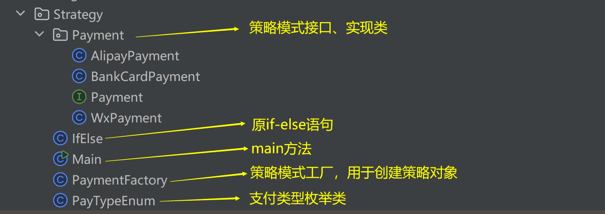

# 策略模式

策略模式是解决过多 `if-else`（或者 `switch-case`） 代码块的方法之一。

## 为什么要用

当 `if-else` 块中的代码量比较大时，后续的扩展和维护会变得非常复杂且容易出错。在阿里《Java开发手册》中，有这样的规则：`超过3层的 if-else 的逻辑判断代码可以使用卫语句、策略模式、状态模式等来实现`

`if-else` 代码示例

```
········
Order order = 订单信息
if (payType == 微信支付) {
    微信支付流程
} else if (payType == 支付宝) {
    支付宝支付流程
} else if (payType == 银行卡) {
    银行卡支付流程
} else {
    暂不支持的支付方式
}
········
```

如上所示，如果相同的 `if-else` 在代码中经常出现，当需要再增加一种支付方式时，需要在所有用到此代码块的地方额外加 `if-else` 语句。此时的代码可维护性与拓展性大大降低，并且容易出错。

使用策略模式，可以将相同部分代码抽离集成，方便以后的拓展。


## 怎么用

### 策略模式的代码结构



#### 枚举类

```java
package creational.Strategy;

/**
 * 支付方式枚举类
 *
 * @author 刘新
 * @create 2024/6/24 下午4:52
 */
public class PayTypeEnum {

    /**
     * 微信支付
     */
    public static final Integer WX = 1;
    public static final String WX_NAME = "微信支付";


    /**
     * 支付宝支付
     */
    public static final Integer ALIPAY = 2;
    public static final String ALIPAY_NAME = "支付宝支付";

    /**
     * 银联支付
     */
    public static final Integer BANK_CARD = 3;
    public static final String BANK_CARD_NAME = "银联支付";
}

```


### 策略接口的定义

```java
package creational.Strategy.Payment;

/**
 * 策略接口的定义
 * 通常包含两个方法：获取策略类型的方法和处理策略业务逻辑的方法。
 *
 * @author 刘新
 * @create 2024/6/24 下午4:51
 */
public interface Payment {

    /**
     * 获取支付方式
     *
     * @return 响应，支付方式
     */
    String getPayType();

    /**
     * 支付调用
     *
     * @param payInfo 调用信息
     * @return 响应，支付结果
     */
    boolean makePay(String payInfo);

}

```


### 策略接口的实现

#### 微信支付策略

```java
package creational.Strategy.Payment;

import creational.Strategy.PayTypeEnum;

/**
 * 微信支付策略实现
 *
 * @author 刘新
 * @create 2024/6/24 下午5:01
 */
public class WxPayment implements Payment {

    @Override
    public String getPayType() {
        return PayTypeEnum.WX_NAME;
    }

    @Override
    public boolean makePay(String payInfo) {
        // 调用微信支付
        boolean wxPay = true;
        if (wxPay) {
            System.out.println("微信支付成功");
            return true;
        } else {
            return false;
        }
    }

}
```

#### 支付宝支付策略

```
package creational.Strategy.Payment;

import creational.Strategy.PayTypeEnum;

/**
 * 支付宝支付策略实现
 *
 * @author 刘新
 * @create 2024/6/24 下午5:05
 */
public class AlipayPayment implements Payment {

    @Override
    public String getPayType() {
        return PayTypeEnum.ALIPAY_NAME;
    }

    @Override
    public boolean makePay(String payInfo) {
        // 调用支付宝支付
        boolean aliPay = true;
        if (aliPay) {
            System.out.println("支付宝支付成功");
            return true;
        } else {
            return false;
        }
    }
}

```


#### 银联支付策略

```java
package creational.Strategy.Payment;

import creational.Strategy.PayTypeEnum;

/**
 * 银联支付策略实现
 *
 * @author 刘新
 * @create 2024/6/24 下午5:07
 */
public class BankCardPayment implements Payment {

    @Override
    public String getPayType() {
        return PayTypeEnum.BANK_CARD_NAME;
    }

    @Override
    public boolean makePay(String payInfo) {
        // 调用银联支付接口
        boolean bankCardPay = true;
        if (bankCardPay) {
            System.out.println("银联支付成功");
            return true;
        } else {
            return false;
        }
    }
}

```


#### 策略对象的创建

```java
package creational.Strategy;

import creational.Strategy.Payment.AlipayPayment;
import creational.Strategy.Payment.BankCardPayment;
import creational.Strategy.Payment.Payment;
import creational.Strategy.Payment.WxPayment;

/**
 * 策略对象的创建
 *
 * @author 刘新
 * @create 2024/6/24 下午4:52
 */
public class PaymentFactory {
    public static Payment getPayment(Integer payType) {
        if (payType == null) {
            throw new RuntimeException("支付类型不能为空.");
        }
        if (payType.equals(PayTypeEnum.WX)) {
            return new WxPayment();
        }
        if (payType.equals(PayTypeEnum.ALIPAY)) {
            return new AlipayPayment();
        }
        if (payType.equals(PayTypeEnum.BANK_CARD)) {
            return new BankCardPayment();
        }
        throw new RuntimeException("支付类型不存在");
    }

}
```


### 策略的使用

```java
package creational.Strategy;

import creational.Strategy.Payment.Payment;

/**
 * 策略模式
 * 策略模式常用于替代 if-else代码块
 *
 * @author 刘新
 * @create 2024/6/24 下午4:38
 */
public class Main {

    public static void main(String[] args) {
        // 使用策略模式将if-else代码块进行封装
        Payment payment = PaymentFactory.getPayment(payType);
        String payName = payment.getPayType();
        System.out.println(payName);
        boolean b = payment.makePay("支付信息数据");
    }

}

```


