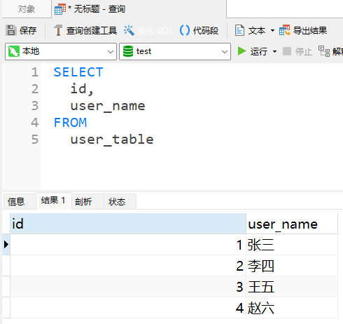
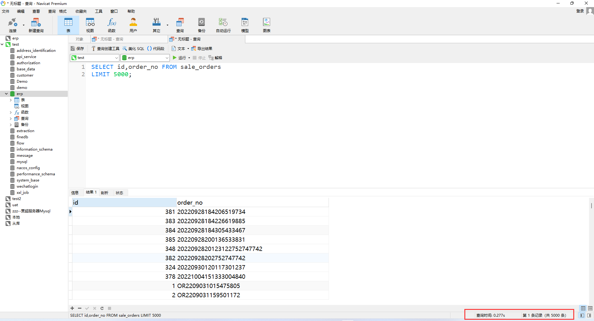
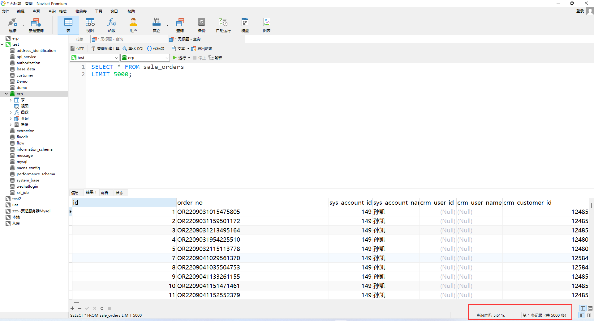
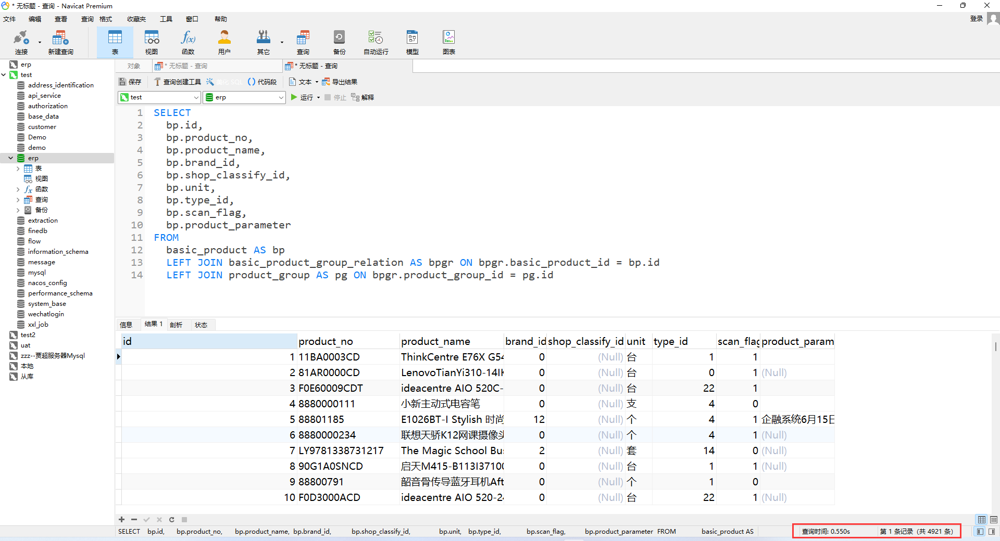
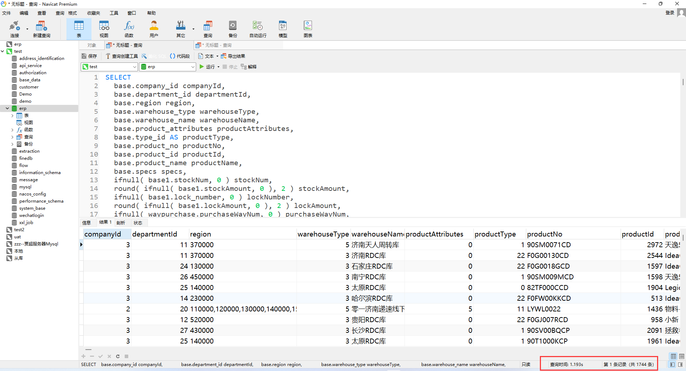

# 基础语法

## 查询

SELECT 语法：

> select ------ 查询
>
> id,name ------ 列名
>
> from ------ 数据来源于哪一张表
>
> user\_table ------ 表名
>
> ```sql
> -- 查询user_table表的数据：
> SELECT
> 	id,
> 	user_name 
> FROM
> 	user_table
> ```



## 常用语法

> 分页
>
> ```sql
> -- limit a,b  a表示查询数据的起始位置，b表示返回的数量。例如:LIMIT 5,10表示从第6行开始显示，显示10条记录 。
> SELECT id,user_name FROM user_table
> limit 0,10
> ```
>
> 分组
>
> ```sql
> -- GROUP BY：对某一列进行分组
> -- GROUP_CONCAT：将分组中的字符连接成一个字段
> SELECT
> 	GROUP_CONCAT(user_name) userName,
> 	sex
> FROM user_table
> GROUP BY sex
> ```
>
> 计数
>
> ```sql
> -- count() 统计返回结果的行数
> SELECT COUNT(*) FROM user_table
>
> -- sum() 对列的值进行求和
> SELECT SUM(id) FROM user_table
> ```
>
> 排序
>
> ```sql
> -- order by 对字段进行排序，desc表示倒序，asc表示正序，默认asc。
> SELECT id,user_name,sex FROM user_table
> ORDER BY id DESC
> ```
>
> 查询条件
>
> ```sql
> -- where 对条件进行筛选
> SELECT id,user_name,sex FROM user_table
> WHERE user_name = '张三'
> -- or 或者
> SELECT id,user_name,sex FROM user_table
> WHERE user_name = '张三' or user_name = '李四'
> -- like 模糊查询
> SELECT id,user_name,sex FROM user_table
> WHERE user_name like '张%'
> -- is not null 不为空
> SELECT id,user_name,sex FROM user_table
> WHERE user_name is not null
> -- is null 为空 
> SELECT id,user_name,sex FROM user_table
> WHERE user_name is null
> ```
>
> 左关联表
>
> ```sql
> -- left join 左关联。from后面查询主表，left join关联表 on后面表示关联条件
> -- 一个用户管理多个客户，查询能够管理到客户名称为‘周扒皮’的用户
> SELECT
> 	u.id,
> 	u.user_name,
> 	u.sex 
> FROM
> 	user_table u
> 	LEFT JOIN crm_table c ON c.user_id = u.id 
> WHERE
> 	c.crm_name = '周扒皮'
> ```

## 索引

### 什么是索引？

MySQL中的索引是一种数据结构，用于提高数据库查询的速度。

### 索引应该加在哪些字段？

在MySQL中，可以加索引的字段通常是那些经常出现在WHERE子句中的字段，特别是大表的字段。此外，索引应该建在选择性高的字段上，而不是小字段上。

例如订单表，索引应该加在订单号、订单状态字段，而不是加载订单备注、详细地址字段

### 查询：

查询时，查询字段与查询条件都为索引字段，查询速度会快很多

如果使用的字段没有索引，对执行时间较长的部分字段建立索引

### 正面案例：



### 反面案例：



### 索引不生效的情况

> 对列进行**计算**或使用**函数**；
>
> ```sql
> select companyId, sum(amount) from company_amoount
> ```
>
> like查询以%开头；
>
> ```sql
> -- 左侧以%开头
> select id, name from users where name like '%张三';
> -- 左右各有一个%
> select id, name from users where name like '%张三%';
> ```
>
> where中使用**or**时，有部分列没有设置索引；
>
> ```sql
> -- id列有索引，remark列无索引
> select id, remark from user_remark
> ```
>
> 使用**not in**，**not exists**，**is null**(位图索引 bitmap)，**is not null**等语句时
>
> ```sql
> -- not in
> select id, name from users where id not in (1,2,3);
> -- not exist
> select id, name from users where not exists (select id from users where id = 13);
> -- is null
> select id, name from users where id name is null;
> -- is not null
> select id, name from users where id name is not null;
> ```
>
> 查询条件使用 **!=**  **< >** ，且不符合条件的数据量比较大时
>
> ```sql
> -- users表中有10万条数据
> select id, name from users where id != 10;
> ```
>
> 索引中有大量重复数据时
>
> ```sql
> -- tag(标签)字段中，存在大量相同的标签值<普通用户>
> select id, tag from user_tag;
> ```

## 表关联

代码规范中，建议表关联不超过三个。

连接表时可以将大表变为小表，先筛选一部分数据再连接其他的表，以减少数据查询量

### 正面案例：



### 反面案例：



```sql
-- 长SQL示例
-- 659 start
SELECT
	base.company_id companyId,
	base.department_id departmentId,
	base.region region,
	base.warehouse_type warehouseType,
	base.warehouse_name warehouseName,
	base.product_attributes productAttributes,
	base.type_id AS productType,
	base.product_no productNo,
	base.product_id productId,
	base.product_name productName,
	base.specs specs,
	ifnull( base1.stockNum, 0 ) stockNum,
	round( ifnull( base1.stockAmount, 0 ), 2 ) stockAmount,
	ifnull( base1.lock_number, 0 ) lockNumber,
	round( ifnull( base1.lockAmount, 0 ), 2 ) lockAmount,
	ifnull( waypurchase.purchaseWayNum, 0 ) purchaseWayNum,
	ifnull( transferway.transferwayNum, 0 ) transferwayNum,
	ifnull( base1.stockNum, 0 )+ ifnull( base1.lock_number, 0 )+ ifnull( waypurchase.purchaseWayNum, 0 ) + ifnull( transferway.transferwayNum, 0 ) + ifnull( reserve.reserveNum, 0 ) AS totalStockNum,
	round( ifnull( base1.stockAmount, 0 ), 2 )+ round( ifnull( base1.lockAmount, 0 ), 2 )+ round( ifnull( waypurchase.purchaseWayAmount, 0 ), 2 ) + round( ifnull( transferway.transWayAmount, 0 ), 2 ) + round( ifnull( reserve.reserveAmount, 0 ), 2 ) AS totalStockAmount,
	round( ifnull( base1.stockCost, 0 ), 4 ) stockCost,
	round( ifnull( waypurchase.purchaseWayCost, 0 ), 4 ) purchaseWayCost,
	ifnull( waypurchase.purchaseWayAmount, 0 ) purchaseWayAmount,
	round( ifnull( transferway.transWayCost, 0 ), 4 ) transWayCost,
	round( ifnull( transferway.transWayAmount, 0 ), 2 ) transWayAmount,
	round( ifnull( reserve.reserveCost, 0 ), 4 ) reserveCost,
	ifnull( reserve.reserveNum, 0 ) reserveNum,
	round( ifnull( reserve.reserveAmount, 0 ), 2 ) reserveAmount,
	ifnull( pg.product_group_name, '' ) productGroupName 
FROM
	(
	SELECT DISTINCT
		w.company_id,
		wpa.department_id,
		w.warehouse_name,
		wpa.warehouse_id,
		wpa.product_attributes,
		wpa.product_no,
		wpa.basic_product_id AS productId,
		w.region,
		w.warehouse_type,
		bp.type_id,
		bp.id AS product_id,
		bp.product_name,
		bp.specs 
	FROM
		warehouse_product_age wpa
		LEFT JOIN basic_product bp ON wpa.product_no = bp.product_no
		LEFT JOIN warehouse w ON wpa.warehouse_id = w.id
		LEFT JOIN (
		SELECT
			sum(
			ifnull( lock_number, 0 )) lock_number,
			sspl.product_no,
			sspl.product_attributes,
			sspl.warehouse_id 
		FROM
			slip_stock_product_lock sspl 
		GROUP BY
			sspl.product_no,
			sspl.product_attributes,
			sspl.warehouse_id 
		) spl ON wpa.product_no = spl.product_no 
		AND wpa.product_attributes = spl.product_attributes 
		AND wpa.warehouse_id = spl.warehouse_id 
	WHERE
		wpa.product_attributes IS NOT NULL UNION
		(
		SELECT DISTINCT
			w.company_id,
			w.department_id,
			w.warehouse_name,
			w.id warehouse_id,
			wsi.product_attributes,
			bp.product_no,
			bp.id productId,
			w.region,
			w.warehouse_type,
			bp.type_id,
			bp.id AS product_id,
			bp.product_name,
			bp.specs 
		FROM
			way_stock_info wsi
			LEFT JOIN warehouse w ON wsi.warehouse_id = w.id
			LEFT JOIN basic_product bp ON wsi.basic_product_id = bp.id 
		) 
	) base
	LEFT JOIN (
	SELECT
		w.company_id,
		wpa.department_id,
		w.warehouse_name,
		wpa.warehouse_id,
		concat( wpa.product_attributes, '' ) product_attributes,
		wpa.product_no,
		wpa.basic_product_id AS productId,
		w.region,
		concat( w.warehouse_type, '' ) warehouse_type,
		bp.type_id,
		bp.id AS product_id,
		bp.product_name,
		sum( wpa.available_quantity ) AS stockNum,
		si.weighted_average_price AS stockCost,
		round( si.weighted_average_price, 4 ) * sum( wpa.available_quantity ) AS stockAmount,
		ifnull( spl.lockAmount, 0 ) lockAmount,
		ifnull( spl.lock_number, 0 ) AS lock_number 
	FROM
		warehouse_product_age wpa
		LEFT JOIN basic_product bp ON wpa.product_no = bp.product_no
		LEFT JOIN warehouse w ON wpa.warehouse_id = w.id
		LEFT JOIN (
		SELECT
			sum(
			ifnull( lock_number, 0 )) lock_number,
			sum( ifnull( lock_number, 0 ) * round( sspl.cost_price, 4 ) ) AS lockAmount,
			sspl.product_no,
			sspl.product_attributes,
			sspl.warehouse_id 
		FROM
			slip_stock_product_lock sspl 
		GROUP BY
			sspl.product_no,
			sspl.product_attributes,
			sspl.warehouse_id 
		) spl ON wpa.product_no = spl.product_no 
		AND wpa.product_attributes = spl.product_attributes 
		AND wpa.warehouse_id = spl.warehouse_id
		LEFT JOIN stock_info si ON wpa.basic_product_id = si.basic_product_id 
		AND wpa.warehouse_id = si.warehouse_id 
	WHERE
		wpa.product_attributes IS NOT NULL 
		AND si.enter_product_number > 0 
	GROUP BY
		wpa.department_id,
		wpa.warehouse_id,
		wpa.product_no,
		wpa.product_attributes,
		bp.type_id 
	) base1 ON base.company_id = base1.company_id 
	AND base.department_id = base1.department_id 
	AND base.warehouse_id = base1.warehouse_id 
	AND base.product_no = base1.product_no 
	AND base.product_attributes = base1.product_attributes 
	AND base.type_id = base1.type_id
	LEFT JOIN (
	SELECT
		sum( wsi.way_stock_number ) AS purchaseWayNum,
		w.company_id,
		w.department_id,
		wsi.warehouse_id,
		bp.product_no,
		wsi.product_attributes,
		bp.type_id,
		pd.purchaseWayCost,
		sum( pd.purchaseWayCost * wsi.way_stock_number ) AS purchaseWayAmount 
	FROM
		way_stock_info wsi
		LEFT JOIN warehouse w ON w.id = wsi.warehouse_id
		LEFT JOIN basic_product bp ON wsi.basic_product_id = bp.id
		LEFT JOIN (
		SELECT
			round(
				sum((
						pd.purchase_quantity * pd.purchase_unit_price 
						)-(
						pd.enter_total_number * pd.purchase_unit_price 
					)) / sum( ( pd.purchase_quantity )-( pd.enter_total_number ) ),
				4 
			) AS purchaseWayCost,
			pd.basic_product_id,
			po.warehouse_id,
			po.product_attributes 
		FROM
			purchase_detail pd
			LEFT JOIN purchase_order po ON pd.purchase_order_id = po.id 
		WHERE
			LEFT ( po.`status`, 2 ) IN ( 17, 18 ) 
		GROUP BY
			pd.basic_product_id,
			po.warehouse_id,
			po.product_attributes 
		) pd ON wsi.warehouse_id = pd.warehouse_id 
		AND wsi.basic_product_id = pd.basic_product_id 
		AND wsi.product_attributes = pd.product_attributes 
	WHERE
		wsi.way_type = 1 
		AND wsi.way_stock_number > 0 
		AND source_type = 0 
	GROUP BY
		w.department_id,
		wsi.warehouse_id,
		bp.product_no,
		wsi.product_attributes,
		bp.type_id 
	) waypurchase ON base.company_id = waypurchase.company_id 
	AND base.department_id = waypurchase.department_id 
	AND base.warehouse_id = waypurchase.warehouse_id 
	AND base.product_no = waypurchase.product_no 
	AND base.product_attributes = waypurchase.product_attributes 
	AND base.type_id = waypurchase.type_id
	LEFT JOIN (
	SELECT
		sum( wsi.way_stock_number ) AS transferwayNum,
		sum( wsi.way_stock_number * tod.transWayCost ) AS transWayAmount,
		tod.transWayCost,
		w.company_id,
		w.department_id,
		wsi.warehouse_id call_in_warehouse_id,
		bp.product_no,
		wsi.product_attributes,
		bp.type_id 
	FROM
		way_stock_info wsi
		LEFT JOIN warehouse w ON w.id = wsi.warehouse_id
		LEFT JOIN basic_product bp ON wsi.basic_product_id = bp.id
		LEFT JOIN (
		SELECT
			round( sum( totalTransAmt )/ sum( transCost ), 4 ) transWayCost,
			product_id,
			call_in_warehouse_id 
		FROM
			(
			SELECT
				sum( tod.transfer_out_cost_price * tod.transfer_quantity ) totalTransAmt,
				sum( tod.transfer_quantity ) AS transCost,
				tod.product_id,
				tf.call_in_warehouse_id 
			FROM
				transfer_order_details tod
				LEFT JOIN transfer_order tf ON tod.transfer_order_id = tf.id 
			WHERE
				tod.STATUS = 4 
			GROUP BY
				tod.product_id,
				tf.call_in_warehouse_id UNION
			SELECT
				sum( cdd.cost_price * cdd.quantity ) totalTransAmt,
				sum( cdd.quantity ) AS transCost,
				cdd.basic_product_id product_id,
				cdo.enter_warehouse_info_id call_in_warehouse_id 
			FROM
				call_delivery_details cdd
				LEFT JOIN call_delivery_orders cdo ON cdd.call_delivery_orders_id = cdo.id 
			WHERE
				cdo.order_status = 13 
			GROUP BY
				cdd.basic_product_id,
				cdo.enter_warehouse_info_id 
			) a 
		GROUP BY
			a.product_id,
			a.call_in_warehouse_id 
		) tod ON tod.product_id = wsi.basic_product_id 
		AND tod.call_in_warehouse_id = wsi.warehouse_id 
	WHERE
		wsi.way_type IN ( 2, 3 ) 
		AND wsi.way_stock_number > 0 
		AND source_type IN ( 1, 4 ) 
	GROUP BY
		w.department_id,
		wsi.warehouse_id,
		bp.product_no,
		wsi.product_attributes,
		bp.type_id 
	) transferway ON base.company_id = transferway.company_id 
	AND base.department_id = transferway.department_id 
	AND base.warehouse_id = transferway.call_in_warehouse_id 
	AND base.product_no = transferway.product_no 
	AND base.product_attributes = transferway.product_attributes 
	AND base.type_id = transferway.type_id
	LEFT JOIN (
	SELECT
		sum( rid.quantity - rid.release_quantity ) AS reserveNum,
		sum( ( rid.quantity - rid.release_quantity ) * reservecost.reserveCost ) AS reserveAmount,
		reservecost.reserveCost reserveCost,
		w.company_id,
		w.department_id,
		rio.warehouse_id,
		bp.product_no,
		rid.product_attributes,
		bp.type_id 
	FROM
		reserve_inventory_order rio
		LEFT JOIN reserve_inventory_distribute rid ON rio.id = rid.reserve_inventory_id
		LEFT JOIN (
		SELECT
			round( totalReserveAmt / reserveCost, 4 ) reserveCost,
			basic_product_id,
			warehouse_id 
		FROM
			(
			SELECT
				sum(
				rio.cost_price * ( rio.apply_quantity - rio.release_quantity )) totalReserveAmt,
				sum( rio.apply_quantity - rio.release_quantity ) AS reserveCost,
				rio.basic_product_id,
				rio.warehouse_id 
			FROM
				reserve_inventory_order rio 
			WHERE
				rio.del_flag = 0 
				AND rio.order_status IN ( '11', '12', '13' ) 
				AND rio.apply_quantity - rio.release_quantity > 0 
			GROUP BY
				rio.basic_product_id,
				rio.warehouse_id 
			) a 
		) reservecost ON reservecost.basic_product_id = rio.basic_product_id 
		AND reservecost.warehouse_id = rio.warehouse_id
		LEFT JOIN warehouse w ON w.id = rio.warehouse_id
		LEFT JOIN basic_product bp ON rio.basic_product_id = bp.id 
	WHERE
		rio.del_flag = 0 
		AND rio.order_status IN ( '11', '12', '13' ) 
		AND rid.quantity - rid.release_quantity > 0 
	GROUP BY
		w.department_id,
		rio.warehouse_id,
		bp.product_no,
		rid.product_attributes,
		bp.type_id 
	) reserve ON base.company_id = reserve.company_id 
	AND base.department_id = reserve.department_id 
	AND base.warehouse_id = reserve.warehouse_id 
	AND base.product_no = reserve.product_no 
	AND base.product_attributes = reserve.product_attributes 
	AND base.type_id = reserve.type_id
	LEFT JOIN basic_product_group_relation bpgr ON bpgr.basic_product_id = base.productId
	LEFT JOIN product_group pg ON bpgr.product_group_id = pg.id
-- 918 end
```

## explain进行调优

explain：性能分析函数

### 信息说明

一般情况下，主要关注**type**、**possible\_keys**、**rows**参数

| **参数名**        | **释义**                 |
| :------------- | :--------------------- |
| id             | 语句唯一表示                 |
| select\_type   | 查询类型                   |
| table          | 表名                     |
| type           | 连接类型（eq\_ref、ref、all等） |
| possible\_keys | 可能用到的索引（列出的索引也可能没用到）   |
| key            | 实际选择的索引                |
| key\_len       | 索引的长度                  |
| ref            | 索引的哪一列被引用              |
| rows           | 扫描的行数                  |
| Extra          | 附加信息                   |

### type

查询速度从快到慢分别为：

> system：该表只有一行（相当于系统表），system是const类型的特例\
> const：针对主键或唯一索引的等值查询扫描, 最多只返回一行数据\
> eq\_ref：等值联表查询使用主键索引或使用唯一性非空索引进行查找\
> ref：使用非唯一性索引进行数据查找\
> range：使用了索引查询，并限制了查询范围\
> index：全索引扫描\
> all：全表扫描

### 性能从强到差：

<span   style="background:linear-gradient( to right,   #4EAE04, #36BE52, #93E312, #B0D08D, #e6c07b, #FF8810, #F37A29); font-size: x-large; font-family: 黑体; "> system > const > eq\_ref > ref > ref\_or\_null > index\_merge > unique\_subquery > index\_subquery > range > index > all

</span>

一般要求至少是**range**级别，最好能达到**ref**级别。

### 特殊情况：


\<auto\_key0>：优化器为派生表生成的索引。中间索引。

## 在Oracle中使用WITH优化子查询

### 使用with前后的sql对比

**使用前：**

> 一层套一层，逻辑复杂混乱，可读性差
>
> 子查询索引可能会失效，执行速度慢


```sql
select
  su.id,
  ta.orgName,
  tb.taskName
from
  sys_user su
  left join (
    select
      soa.id,
      soa.user_id as userId,
      so.name as orgName
    from
      sys_org_amount soa left sys_org so on soa.org_id = so.id
    where
      soa.amount_code in ('1001', '1002')
      and soa.del_flag = 0
      and soa.create_time >= '2024-05-24'
      and soa.create_time <= '2024-06-24'
  ) ta on su.user_id = ta.user_id
  left join (
    select
      st.id,
      st.name as taskName,
      stu.user_id as userId
    from
      sys_task_user stu
      left join sys_task st on stu.task_id = st.id
    where
      st.id in ('TK001', 'TK002')
  ) tb on su.user_id = tb.userId
```

**使用后：**

> 将子查询抽离出来，提高可读性
>
> 使用  `/*+ materialize */`  提高整体性能

```sql
-- 使用with将子查询抽离
WITH
  table_to_a as (
    select
      /*+ materialize */
      soa.id,
      soa.user_id as userId,
      so.name as orgName
    from
      sys_org_amount soa left sys_org so on soa.org_id = so.id
    where
      soa.amount_code in ('1001', '1002')
      and soa.del_flag = 0
      and soa.create_time >= '2024-05-24'
      and soa.create_time <= '2024-06-24'
  ),
  table_to_b as (
    select
      /*+ materialize */
      st.id,
      st.name as taskName,
      stu.user_id as userId
    from
      sys_task_user stu
      left join sys_task st on stu.task_id = st.id
    where
      st.id in ('TK001', 'TK002')
  )
  
select
  su.id,
  ta.orgName,
  tb.taskName
from
  sys_user su
  left join table_to_a ta on su.user_id = ta.user_id
  left join table_to_b tb on su.user_id = tb.userId
```


### with的用法

```sql
with as语法
–针对一个别名
with tmp as (select * from tb_name)
 
–针对多个别名
with
   tmp as (select * from tb_name),
   tmp2 as (select * from tb_name2),
   tmp3 as (select * from tb_name3),
   .....
```

### with中的关键字及应用场景

| 关键字      | 描述                                          | 应用场景                                                     |
| :---------- | :-------------------------------------------- | ------------------------------------------------------------ |
| materialize | 强制将 with as 中的子查询结果集转换为临时表   | 如果在 with as 中的子查询返回结果集很大，且调用该子查询不走索引时，加 materialize 能极大提升整体性能 |
| inline      | 强制不将 with as 中的子查询结果集转换为临时表 | 如果在 with as 中的子查询返回结果集很小，且调用该子查询能走索引时，加 materialize 反而会降低整体性能，这种情况下，为稳定性能，可使用 inline 抑制其转换为临时表。 |

**格式**

```sql
with tmp as (select /*+ materialize */ * from tb_name)
 
或者
 
with tmp as (select /*+ inline*/ * from tb_name)
```


## distinct 和 group by

### 去重对比

> distinct对所有字段进行去重\
> group by 对指定字段进行去重

### 效率对比

> 在语义相同，有索引的情况下：`group by`和distinct都能使用索引，效率相同。\
> 在语义相同，无索引的情况下：distinct效率高于`group by`。原因是distinct 和 `group by`都会进行分组操作，但`group by`可能会进行排序，触发filesort，导致sql执行效率低下。

### 推荐group by的原因

> group by语义更为清晰\
> group by可对数据进行更为复杂的一些处理

## count()统计行数

### count(\*)

在Mysql中，`count(*)`的作用是统计表中记录的总行数。

而`count(*)`的性能跟存储引擎有直接关系，并非所有的存储引擎，`count(*)`的性能都很差。

在Mysql中使用最多的存储引擎是：`innodb`和`myisam`。

在**myisam**中会把总行数保存到磁盘上，使用count(\*)时，只需要返回那个数据即可，无需额外的计算，所以执行效率很高。

在**innodb**使用count(\*)时，需要从存储引擎中一行行的读出数据，然后累加起来，所以执行效率很低。

### count的各种用法性能对比

> count(\*) ：它会获取所有行的数据，不做任何处理，行数加1
>
> count(1)：它会获取所有行的数据，每行固定值1，也是行数加1。
>
> count(id)：id代表主键，它需要从所有行的数据中解析出id字段，其中id肯定都不为NULL，行数加1。
>
> count(普通索引列)：它需要从所有行的数据中解析出普通索引列，然后判断是否为NULL，如果不是NULL，则行数+1。
>
> count(未加索引列)：它会全表扫描获取所有数据，解析中未加索引列，然后判断是否为NULL，如果不是NULL，则行数+1。

### count的性能从高到低

 <span style="background:linear-gradient( to right,   #0FB746, #17C913, #4DD60C, #93E312, #C4E759); font-size: x-large; font-family: 黑体,serif; "> count(\*) ≈ count(1) > count(id) > count(普通索引列) > count(未加索引列)

</span>

