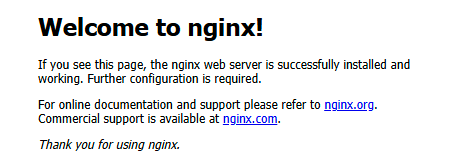

# Nginx

## 介绍

特点：高并发、高性能

使用场景：路由转发、文件服务器、负载均衡

## 安装

下载地址：[nginx：下载](https://nginx.org/en/download.html)


#### Linux环境下的安装


#### Windows环境下的安装

1. 下载安装包后，解压缩到目录下（目录不含中文）

2. 在解压缩后的目录中，双击nginx.exe即可启动

3. nginx默认占用80端口，在浏览器输入localhost:80，看到以下内容，证明启动成功



## 常用命令

### Linux

```shell
# 重新加载配置⽂件
nginx -s reload

# 重启
nginx -s reopen 

# 快速关闭
nginx -s stop

# 等待⼯作进程处理完成后关闭
nginx -s quit

# 查看当前 Nginx 最终的配置
nginx -T 

# 检查配置是否有问题
nginx -t 
```


### Windows

需要在nginx的安装目录下运行命令

```shell
# 查看所有可以执行的命令
.\nginx.exe -h

# 查看nginx版本
.\nginx.exe -v

# 重启
.\nginx.exe -s reopen

# 重新加载配置文件
.\nginx.exe -s reload

# 停止
.\nginx.exe -s stop

# 查看当前 Nginx 最终的配置
.\nginx.exe -T 

# 检查配置是否有问题
.\nginx.exe -t 
```


## 常用配置信息

nginx配置文件在 `/安装目录/nginx-1.xx.xx/conf/nginx.conf`

### main

main段配置信息，配置后基本不修改

```shell
# main段配置信息
user nginx;    # 运⾏⽤户，默认即是nginx，可以不进⾏设置
worker_processes auto;    # Nginx 进程数，⼀般设置为和 CPU 核数⼀样
error_log /var/log/nginx/error.log warn;    # Nginx 的错误⽇志存放⽬录
pid /var/run/nginx.pid;    # Nginx 服务启动时的 pid 存放位置
```


### events

events段配置信息，一般不会进行配置（或使用默认配置不进行修改）

```shell
# events段配置信息
events {
    use epoll;    # 使⽤epoll的I/O模型(如果你不知道Nginx该使⽤哪种轮询⽅法，会⾃动选择⼀个最适合你操作系统的)
    worker_connections 1024;    # 每个进程允许最⼤并发数
}
```


### http

http段配置信息， 配置使用最频繁的部分，代理、缓存、日志定义等绝大多数功能和第三方模块的配置都在这里设置

```shell
# http段配置信息
# todo 暂时没完全研究明白


http {
    # 设置⽇志模式
    log_format	main 	'$remote_addr - $remote_user [$time_local] "$request" '
                    	'$status $body_bytes_sent "$http_referer" '
                    	'"$http_user_agent" "$http_x_forwarded_for"';
    access_log	/var/log/nginx/access.log main; # Nginx访问⽇志存放位置
    
    sendfile				on; # 开启⾼效传输模式
    tcp_nopush				on; # 减少⽹络报⽂段的数量
    tcp_nodelay				on;
    keepalive_timeout		65; # 保持连接的时间，也叫超时时间，单位秒
    types_hash_max_size		2048;

    include					/etc/nginx/mime.types; # ⽂件扩展名与类型映射表
    default_type			application/octet-stream; # 默认⽂件类型
    
    include 				/etc/nginx/conf.d/*.conf; # 加载⼦配置项

    # server段配置信息(最常用)
    server {
        listen 80; # 配置监听的端⼝
        server_name localhost; # 配置的域名

        # location段配置信息
        location / {
            root /usr/share/nginx/html; # ⽹站根⽬录
            index index.html index.htm; # 默认⾸⻚⽂件
            deny 172.168.22.11;			# 禁⽌访问的ip地址，可以为all
            allow 172.168.33.44;		# 允许访问的ip地址，可以为all
        }

        error_page 500 502 503 504 /50x.html; # 默认50x对应的访问⻚⾯
        error_page 400 404 error.html; # 同上
    }
}

```

### server

server段配置信息，属于http段配置信息的一部分。最常用的配置

#### 示例1：新增访问页面

```shell
    # 静态页面
    server {
        listen       12345;					# 监听的端口
        server_name  localhost;				# 配置的域名
        
        location / {
            root   D:/workSpace/nginx-html; # html所在的目录
            index  index.html index.htm;	# 首页html文件
        }
    }
```


#### 示例2：对请求的url进行转发

```shell
   # 路由转发
    server {
        listen 12346;
        server_name localhost;

        location / {
            proxy_pass http://www.baidu.com; # 将路由转发到www.baidu.com
        }
    }
```


#### 示例3：nginx文件服务器

```shell
    # 文件服务器
    server {
        listen 12347;
        server_name localhost;

        location / {
            root D:/home;				# 指向文件存放的位置
            autoindex on;				# 启用自动目录列表功能。on时，url目录充当文件夹
            autoindex_exact_size off;	# 是否显示文件字节大小。是:显示字节；否:显示近似值大小
            charset utf-8;				# 编码格式
        }
    }
```

